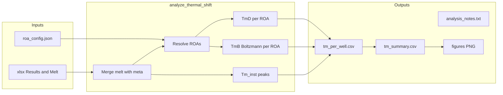

# IL-10 Protein thermal shift 实验记录（QuantStudio / PTS 思路）

本文档与仓库脚本 `analyze_thermal_shift.py`、`plot_tmd_sybro25x_histogram.py` 的实现严格对齐，便于飞书存档与复核。

---

## 一、实验原理与核心量（数学与物理含义）

### 1.1 两态热展开与 Boltzmann 型拟合（TmB、B_fit、TmB 拟合标准误）

在稀释蛋白与染料条件下，DSF/PTS 常将单域或协同展开近似为**两态**：天然态（N）与展开态（U），荧光强度 \(F\) 随温度变化呈 S 型过渡。脚本不估计 Van’t Hoff 焓变，而是用**四参数 Logistic 型 Boltzmann 曲线**在温度窗口内描述 \(F(T)\)，与仪器厂商文档中常见的 S 型拟合一致。

**模型（与代码 `boltzmann_4p` 一致）**

记温度为 \(T\)（单位与数据一致，通常为 °C），拟合形式为：

\[
F(T)=f_{\min}+\frac{f_{\max}-f_{\min}}{1+\exp\left(\dfrac{t_m-T}{s}\right)}
\]

- \(f_{\min}, f_{\max}\)：低温/高温渐近荧光水平（脚本中参数 `fmin`, `fmax`）。
- \(t_m\)：**拐点温度**，脚本将其作为 **TmB**（列名 `TmB_ROAk`，代码变量名 `tm`）。在理想对称 S 型中，\(t_m\) 对应过渡中点；\(s\) 控制过渡陡峭程度（代码变量名 `s`，须 \(s>0\)）。
- 拟合在**每个孔、每个 ROA** 内，对**原始 Fluorescence** 与落入该区间的温度点进行；**Savitzky–Golay 平滑仅用于数值导数路径下的 TmD，不用于 Boltzmann 的 \(F\)**。

**非线性最小二乘**

使用 `scipy.optimize.curve_fit`，以有界参数空间搜索 \((f_{\min},f_{\max},t_m,s)\)。初值与上下界由 ROA 内数据的最小/最大荧光与温度范围构造（见 `fit_boltzmann_roa`）。若 ROA 内有效点数 **少于 8**，不进行拟合，输出 `nan`。

**决定系数 B_fit（即 \(R^2\)）**

对 ROA 内观测 \(F_i\) 与拟合值 \(\hat F_i\)：

\[
\mathrm{SS}_{\mathrm{res}}=\sum_i (F_i-\hat F_i)^2,\quad
\mathrm{SS}_{\mathrm{tot}}=\sum_i (F_i-\bar F)^2,\quad
R^2 = 1-\frac{\mathrm{SS}_{\mathrm{res}}}{\mathrm{SS}_{\mathrm{tot}}}
\]

当 \(\mathrm{SS}_{\mathrm{tot}}\) 过小（代码阈值 \(10^{-12}\)）或数值异常时，\(R^2\) 记为 `nan`。输出列名为 `Bfit_ROAk`。

**TmB 拟合渐近标准误（`TmB_ROAk_fit_se`）**

在加权最小二乘的经典假设下，参数估计的近似协方差矩阵由 `curve_fit` 返回的 `pcov` 给出。\(t_m\) 对应 `popt` 的第 **3** 个分量（0 基索引为 **2**），其渐近标准误取：

\[
\mathrm{SE}(t_m)=\sqrt{(\mathbf{pcov})_{2,2}}
\]

若 `pcov` 不可用、非有限或开方后为负，则记为 `nan`。**注意**：边界解、残差非独立、模型失配或数据点过少时，渐近 SE 可能不可靠，仅供辅助参考。

---

### 1.2 TmD：导数信号、拾峰算法与仪器对照

**物理含义（操作定义）**

**TmD**（Derivative-based melting temperature，脚本列名 `TmD_ROAk`）定义为：在指定 **ROA** 内，对某一「热展开敏感信号」关于温度的曲线取**主峰（局部极大）**所对应的温度。该定义与「导数峰」读数一致，**不等同**于 Boltzmann 拐点 \(t_m\)，二者数值可能接近也可能偏离。

**信号 A：荧光数值导数（默认 `--tmd-source fluorescence`）**

1. 取该孔排序后的温度序列 \(T_i\) 与原始荧光 \(F_i\)。
2. 若 `--sg-window` 为 **0**（默认）：直接用 \(F_i\) 计算离散导数；若 \(\geq 3\)：先用 **Savitzky–Golay** 滤波得到平滑序列 \(\tilde F_i\)（窗口为奇数，代码会将偶数窗口 +1，并限制 `window ≤ n` 等），再对 \(\tilde F_i\) 求导。**Boltzmann 仍用原始 \(F_i\)**。
3. 离散导数由 `numpy.gradient(F, T)` 实现，即对非均匀采样温度使用 numpy 的梯度定义（与均匀网格的差分形式一致，为链式法则下的数值近似）。
4. 若 `--negate`：对用于**拾峰与双子图下子图**的导数信号乘以 \(-1\)，使主峰朝上，便于与仪器习惯一致。

**信号 B：仪器导数列（`--tmd-source instrument_derivative`）**

直接使用 Melt 表中的 **Derivative** 列（可选 `--negate` 取负）。**不参与** Savitzky–Golay 窗口（`--sg-window` 对该拾峰无效）。

**ROA 内拾峰（`pick_peak_in_roa`）**

设 ROA 内索引为 \(i=0,\ldots,N-1\)，信号值为 \(S_i\)（即上述 \(dF/dT\)、\(-dF/dT\) 或 \(\pm\)Derivative）。

- 若 \(N<3\)：**无**局部极大判定，直接取 \(\arg\max_i S_i\) 对应温度。
- 若 \(N\geq 3\)：在**内点** \(i=1,\ldots,N-2\) 上寻找**严格局部极大**：\(S_i \geq S_{i-1}\) 且 \(S_i \geq S_{i+1}\)；在所有满足条件的内点中取 **\(S_i\) 最大者** 对应温度作为 TmD。
- 若不存在有限局部极大（例如平台或数值退化）：退化为 **ROA 内全局 \(\arg\max S_i\)** 对应温度。

**全区间仪器两峰 `Tm_inst_1` / `Tm_inst_2`（对照，非 ROA 内）**

在**整段**升降温序列上，对仪器 Derivative（可 `--negate`）找所有内点局部极大，按峰高降序排列；**第一峰**温度为 `Tm_inst_1`；**第二峰**为第一个与第一峰温差 **至少** `--peak-min-sep`（默认 3 °C）的峰温，若无则 `nan`。用于与 ROA 内 TmD 对照，**不替代** ROA 分析。

---

### 1.3 组内汇总统计与 95% 置信区间

对同一 **`plate` + `Sample Name`**（技术重复多孔）：

- **均值**：\(\bar x=\frac{1}{n}\sum x_i\)（忽略非数值与缺失）。
- **样本标准差**：\(s=\sqrt{\frac{1}{n-1}\sum (x_i-\bar)^2}\)（`ddof=1`）；\(n=1\) 时 SD 为 `nan`，字符串显示为 `mean ± NA`。
- **95% 置信区间（技术重复，\(t\) 分布）**：当 \(n\geq 2\) 且 scipy 可用时，
  \[
  \bar x \pm t_{0.975,\,n-1}\cdot \frac{s}{\sqrt{n}}
  \]
  其中 \(t_{0.975,\,n-1}\) 为 `scipy.stats.t.ppf(0.975, df=n-1)\)。输出列：`TmD_ROAk_ci95_low/high`、`TmB_ROAk_ci95_low/high` 及可读字符串 `*_mean_ci95`。**TmD 不定义 \(R^2\)**；\(R^2\) 仅针对 Boltzmann 的 `Bfit_ROAk`。

组内还对 **`Bfit_ROAk`** 报告 **min、median**；对 **`TmB_ROAk_fit_se`** 报告组内 **mean、median**（列名 `TmB_ROAk_fit_se_mean` / `_median`）。

---

### 1.4 ROA（Region of Analysis）

**含义**：在温度轴上选取的一个或多个**闭区间** \([T_{\mathrm{lo}},T_{\mathrm{hi}}]\)，仅在区间内拾 TmD、拟合 TmB。可屏蔽低温噪声区或高温非单态区。

**解析优先级（`resolve_roas`）**

对给定 `plate_id` 与 `Sample Name`：

1. 若 `plates[plate_id].samples[SampleName].roas` 存在且非 `null` → 使用该列表；
2. 否则若 `plates[plate_id].roas` 非 `null` → 使用该板级列表；
3. 否则若 `defaults.roas` 非 `null` → 使用全局默认；
4. 否则 → 使用该孔数据的全局 \([T_{\min},T_{\max}]\) 作为**单一** ROA。

每段 `roas` 为若干 `[T_lo, T_hi]` 数对；**至多取前 6 段**（`MAX_ROAS=6`）。非法项跳过；若列表为空则回退全区间。

---

### 1.5 小结：TmD 与 TmB 的区分

| 量 | 定义要点 | 与 \(R^2\) 关系 |
|----|----------|----------------|
| **TmD** | ROA 内导数型信号的局部极大（或退化情形下的全局最大） | **无** Boltzmann 型 \(R^2\) |
| **TmB** | 同一 ROA 内对原始 \(F(T)\) 四参数 Boltzmann 的拐点参数 \(t_m\) | **有**，见 `Bfit_ROAk` |

---

## 二、参数与符号表（输出列与工程常量）

### 2.1 工程常量

| 符号/常量 | 值 | 含义 |
|-----------|-----|------|
| `HEADER_ROW` | 45 | Excel 表头行（pandas `header=45`，数据从下一行起） |
| `MAX_ROAS` | 6 | 每孔最多 ROA 段数 |

### 2.2 每孔输出（`tm_per_well.csv`）

| 列名模式 | 含义 |
|----------|------|
| `plate`, `Well`, `Sample Name` | 板 ID、孔号、样品名 |
| `TmD_ROAk` | 第 \(k\) 段 ROA 的 TmD（°C） |
| `TmB_ROAk` | 第 \(k\) 段 ROA 的 Boltzmann 拐点 \(t_m\) |
| `Bfit_ROAk` | 第 \(k\) 段 ROA 的 \(R^2\) |
| `TmB_ROAk_fit_se` | \(t_m\) 的渐近标准误 \(\sqrt{\mathrm{pcov}_{2,2}}\) |
| `Tm_inst_1`, `Tm_inst_2` | 全区间仪器导数第一/第二峰温（受 `--peak-min-sep` 约束） |

\(k=1,2,\ldots\) 至实际 ROA 数；不足列补 `nan`。

### 2.3 分组汇总（`tm_summary.csv`）

分组键：**`plate` + `Sample Name`**（汇总列中样品名为 `Sample_Name`）。

对每个 ROA \(k\)：

| 列名模式 | 含义 |
|----------|------|
| `TmD_ROAk_mean` / `_sd` / `_mean_sd` | TmD 组均值、样本标准差、格式化字符串 |
| `TmD_ROAk_ci95_low` / `_high` / `_mean_ci95` | TmD 组均值 95% CI 下/上界及区间字符串 |
| `TmB_ROAk_*` | 同上，针对 TmB |
| `Bfit_ROAk_mean` / `_sd` / `_mean_sd` | \(R^2\) 的组内统计 |
| `Bfit_ROAk_min` / `_median` | 组内 \(R^2\) 最小值与中位数 |
| `TmB_ROAk_fit_se_mean` / `_fit_se_median` | 组内 `fit_se` 的均值与中位数 |
| `Tm_inst_1_*`, `Tm_inst_2_*` | 两仪器峰在组内的 mean±SD 等 |

另有 `n`（该组孔数）、`mutant_core`（由样品名去掉 `-sybro...` 后缀得到，便于归类）。

---

## 三、数据格式与工程流程

### 3.1 Excel 结构

- **表名**：`Results`、`Melt Curve Raw Data`。
- **表头**：两行表头中，脚本以 **第 46 行** 为列名行（`header=45`）。
- **Results**：用于 `Well`、`Well Position`、`Sample Name`、`Omit`；剔除 Omit、空名、对照（`H2O`、`NTC`、`blank` 等，见 `is_control`）。**不使用** Results 中仪器给出的 Tm 列作分析。
- **Melt Curve Raw Data**：至少包含 `Well`、`Temperature`、`Fluorescence`、`Derivative`；与 Results 过滤后按 `Well` 合并，得到每孔曲线。

### 3.2 默认输入文件（`DEFAULT_XLSX`）

当前脚本内写死为 `base-dir` 下：

- `2026-04-28 IL10 16mutants zhengshizu.xlsx`（`plate_id`: `16mutants`）
- `2026-04-28 IL10 stability test.xlsx`（`plate_id`: `stability_test`）

**新项目**：需将新 xlsx 放入 `base-dir` 并修改 `DEFAULT_XLSX`，或扩展脚本支持命令行传入文件列表（当前版本无该 CLI，以代码为准）。

### 3.3 ROA 配置文件

- 默认查找：`base-dir/roa_config.json`（若存在）。
- 可用 `--roa-config` 指定路径。
- 示例骨架见同目录 `roa_config.example.json`（`roas: null` 表示使用全温区单 ROA）。

### 3.4 主脚本命令行（`analyze_thermal_shift.py`）

| 参数 | 默认 | 说明 |
|------|------|------|
| `--base-dir` | 脚本所在目录 | 含 xlsx 与可选 `roa_config.json` |
| `--out-dir` | `base-dir/output_thermal_shift` | 所有 CSV、说明、图输出根目录 |
| `--tmd-source` | `fluorescence` | `fluorescence`：数值 dF/dT；`instrument_derivative`：仪器 Derivative 拾峰 |
| `--dual-output` | 关闭 | 为真时**先**写 `base-dir/output_thermal_shift_derivative`（仪器导数拾 TmD），**再**写 `--out-dir`（默认荧光导数拾 TmD）；减轻单目录文件占用导致的失败 |
| `--negate` | 关 | 对数值导数与仪器 Derivative 拾峰/作图取负 |
| `--peak-min-sep` | 3.0 | `Tm_inst_1/2` 最小峰间距（°C） |
| `--roa-config` | `None` | 显式 ROA JSON；否则用 `base-dir/roa_config.json` |
| `--sg-window` | 0 | SG 窗口（奇数 ≥3）；0 表示不平滑 |
| `--sg-poly` | 2 | SG 多项式阶，须小于窗口 |

**实践建议**：若 `tm_summary.csv` 被 Excel 打开占用导致写入失败，改用新的 `--out-dir`（例如 `output_thermal_shift_ci_stats`）；不要随意覆盖已用于论文/飞书的旧目录。

### 3.5 输出物

在 `out-dir` 下生成：

- `tm_per_well.csv`：每孔每 ROA 及仪器两峰。
- `tm_summary.csv`：按板+样品汇总。
- `analysis_notes.txt`：与当次 `tmd_source` 匹配的中文说明模板。
- `figures/*.png`：每汇总组一张双子图（原始 F–T + TmD 所用信号，竖线标组内 TmD/TmB 各 ROA 均值）。

仓库中曾用目录名示例（按需自建，非脚本强制）：`output_thermal_shift`、`output_thermal_shift_derivative`、`output_thermal_shift_pymol`、`output_thermal_shift_ci_stats` 等，以**不覆盖**为原则区分实验批次或分析选项。

### 3.6 数据流示意



---

## 四、下游：sybro2.5x TmD 柱状图（可选）

脚本：`plot_tmd_sybro25x_histogram.py`

- **默认输入**：`output_thermal_shift_pymol/tm_summary.csv`（可用 `--summary` 覆盖）。
- **默认输出**：`output_thermal_shift_pymol/figures/tmd_bars_sybro25x_filtered.png`（可用 `--out` 覆盖）。
- **筛选**：`Sample_Name` 匹配 `sybro2.5x`（不区分大小写）；排除含 `12*` 或 `12_` 的行；对 `IL10-WT` 开头样品再排除含 `4*` 或 `4_` 的行。
- **作图顺序**：首柱为 `IL10-standard`（x 标签 `WT_standard`），其余突变体按 **真实 MUT 编号** 升序，标签 `mutN`。
- **纵轴**：汇总表中的 TmD 组均值 ± 组内 SD（脚本自动选取首个存在的 `TmD_ROAk_mean` / `_sd`）。
- **阈值线**：`WT_standard` 的 TmD 均值水平黑色虚线。
- **配色**：与主脚本相同的 `PALETTE_HEX` 线性渐变为柱色；标题与字体等以脚本当前版本为准。

---

## 五、附录：运行环境与命令示例

### 5.1 依赖

- Python 3；**必需**：`numpy`、`pandas`、`matplotlib`、`openpyxl`。
- **强烈建议**：`scipy`（Boltzmann、`curve_fit`、SG、t 分位数）。未安装时 TmB / B_fit / fit_se / CI 等为 `nan` 或 `NA`。

### 5.2 命令示例（在 `protein thermal shift测定` 目录下）

```bash
# 默认：荧光数值导数拾 TmD，输出到 output_thermal_shift
python analyze_thermal_shift.py

# 指定输出目录（推荐用于新批次或避免文件占用）
python analyze_thermal_shift.py --out-dir "./output_thermal_shift_run20260429"

# 仅用仪器 Derivative 拾 TmD
python analyze_thermal_shift.py --tmd-source instrument_derivative --out-dir "./output_thermal_shift_derivative_only"

# 双输出：先 derivative 子目录，再写入 --out-dir
python analyze_thermal_shift.py --dual-output

# 带 SG 平滑再求导（Boltzmann 仍用原始 F）
python analyze_thermal_shift.py --sg-window 15 --sg-poly 2 --out-dir "./output_thermal_shift_sg15"

# 柱状图（按需改路径）
python plot_tmd_sybro25x_histogram.py --summary "./output_thermal_shift_pymol/tm_summary.csv" --out "./output_thermal_shift_pymol/figures/tmd_bars_sybro25x_filtered.png"
```

---

*文档版本与脚本同步；若修改 `analyze_thermal_shift.py` 中算法，请同步更新本节。*
